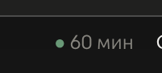

# Cache Timer

A Claude Code mod that shows how long your **prompt cache** stays warm, right in the footer next to the model name.



Every message you send, Claude Code re-sends the whole conversation. The prompt cache lets the model skip re-reading everything before, so replies come faster and use less of your plan. But the cache expires, and the first message after that reloads the whole conversation. Claude Code doesn't show how much time is left. Cache Timer does.

| Footer | Meaning |
| --- | --- |
| `⬤ 60 min` (green) | Fresh. Stays at full time while Claude is answering |
| `⬤ 8 min` (amber) → `⬤ 2 min` (red) | Cooling down. Amber under 10 min, red under 3 |
| `⬤ 1:45` (red) | Last two minutes, counted in seconds. Ask now |
| `⬤ cache cold` (grey) | Expired. Your next message reloads the conversation |

## Install

Requires **Claude Code 2.1.287 or later** (mods). Works in the terminal and in the Code tab of the Claude desktop app.

```bash
claude plugin marketplace add artemvoidd/cache-timer
claude plugin install cache-timer@artemvoidd
```

Start a new session. The timer appears after the first answer.

In the desktop app you can also ask Claude in the Code tab: *“Install the plugin cache-timer from the marketplace artemvoidd/cache-timer”*, then open a new chat.

## Settings

- **Cache lifetime.** Claude Code uses a 1-hour cache for most sessions and a 5-minute one when you are in usage overage. The mod starts at 60 minutes and picks up the real value whenever you switch models. Set it by hand with `/cache-ttl 5` or `/cache-ttl 60`; the choice is remembered.
- **Language.** `en` (default) or `ru`, in `/config` or in `~/.claude/settings.json`:

  ```json
  { "pluginConfigs": { "cache-timer@artemvoidd": { "options": { "language": "ru" } } } }
  ```

## How it works

The mod hooks `turn.start` and `turn.complete` to note when the main conversation last talked to the model, and redraws the footer (`SessionMode`) every 5 seconds. It makes no network requests, reads no files and runs no commands — `claude plugin validate` lists its calls:

```
hooks: session.start, turn.start, turn.complete, classic.PostModelSwitch, command.run{command=cache-ttl}, ui.render{component=SessionMode}
calls: $.clock.every, $.clock.now, $.command.register, $.store.get, $.store.set, $.ui.invalidate, $.ui.resolve
```

What each hook does:

| Hook | What it does | Changes anything? |
| --- | --- | --- |
| `session.start` | Reads the saved TTL, registers `/cache-ttl`, starts a 5-second redraw timer | No |
| `turn.start`, `turn.complete` | Notes the time of the main conversation's last request (subagent turns are ignored) | No, passes the event on unchanged |
| `classic.PostModelSwitch` | Reads `cache_ttl` (5m or 1h) that Claude Code reports on a model switch | No, passes the event on unchanged |
| `command.run` (`cache-ttl` only) | Answers `/cache-ttl 5` and `/cache-ttl 60` and saves the choice in the mod's own store | Only its own command; other commands are not touched |
| `ui.render` (`SessionMode` only) | Adds the dot and the time in front of the footer's mode labels, which stay as they were | Only the footer labels |

The countdown starts from the end of the last answer, so it can be a few seconds off from the exact API request.

---

## По-русски

Мод для Claude Code: в футере рядом с моделью показывает, сколько ещё живёт кэш промпта. Кружок меняет цвет по мере остывания: зелёный → жёлтый → красный, рядом минуты, в последние две — секунды. Когда «кэш остыл» (серый кружок), следующее сообщение заново прогоняет весь диалог — успей задать вопрос до этого.

Установка — две команды выше. Русские подписи: `"language": "ru"` в настройках плагина (пример выше). Время жизни кэша: `/cache-ttl 5` или `/cache-ttl 60`.

## License

MIT
